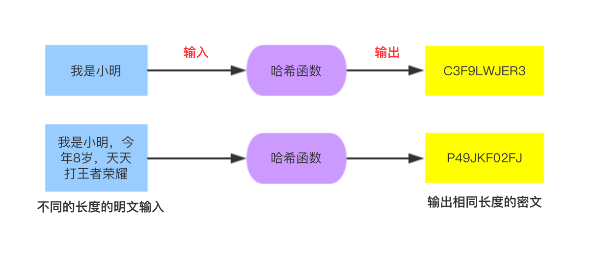

# Hash算法

Hash算法（哈希散列算法）特别之处在于它是一种单向算法，即不可逆，用户可以通过Hash算法对目标信息生成一段特定长度的唯一的Hash值，但是却不能通过这个Hash值重新获得目标信息。

{:height="50%" width="50%"}

因为此特点，Hash算法通常用在存储不可还原的密码存储，信息完整校验等地方。

常用的Hash算法有：MD2、MD4、MD5、HAVAL、SHA、SHA-1、HMAC、HMAC-MD5、HMAC-SHA1