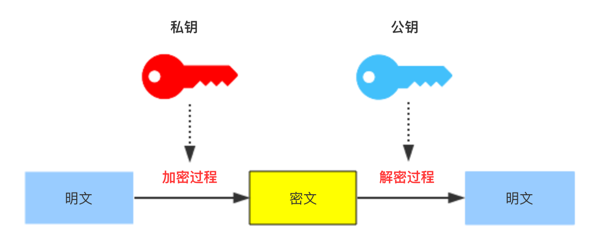

# 非对称加密算法
公开密钥密码学（英语：Public-key cryptography）也称非对称式密码学（英语：Asymmetric cryptography）是密码学的一种算法，它需要两个密钥，一个是公开密钥，另一个是私有密钥；一个用作加密，另一个则用作解密。使用其中一个密钥把明文加密后所得的密文，只能用相对应的另一个密钥才能解密得到原本的明文

{:height="50%" width="50%"}

优点是公钥可以被任何人知道，而公钥的泄漏也不会导致信息泄漏。

缺点是一旦私钥泄漏了就会导致信息泄漏。

常用的非对称加密算法有：RSA、ECC（移动设备用）、Diffie-Hellman、El Gamal、DSA（数字签名用）