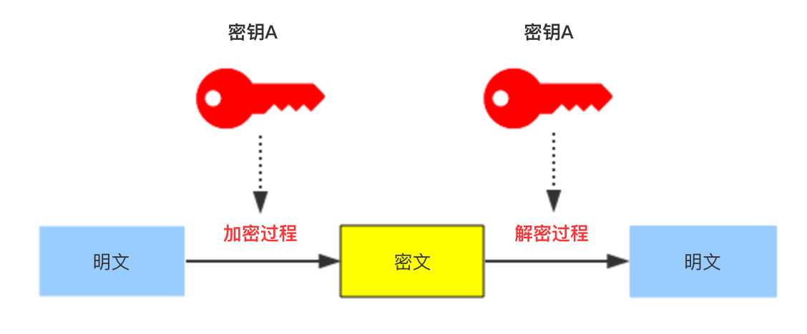

# 对称密钥算法

对称密钥算法（英语：Symmetric-key algorithm）又称为对称加密、私钥加密、共享密钥加密，是密码学中的一类加密算法。这类算法在加密和解密时使用相同的密钥，或是使用两个可以简单地相互推算的密钥

优点是速度较快，适合对数据量比较大的数据进行加密。

缺点是密钥的保存方式需要保证，一旦加密或者解密的哪一方泄漏了密钥，都会导致信息的泄漏。

常用的对称加密算法有:DES、3DES、DESX、Blowfish、IDEA、RC4、RC5、RC6、AES